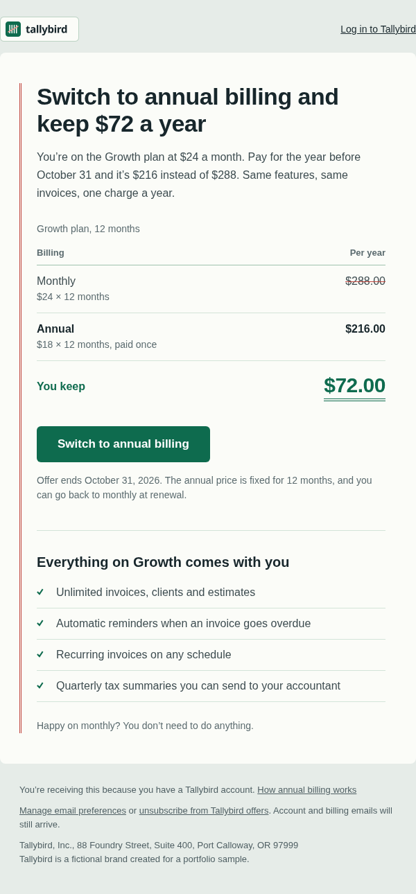
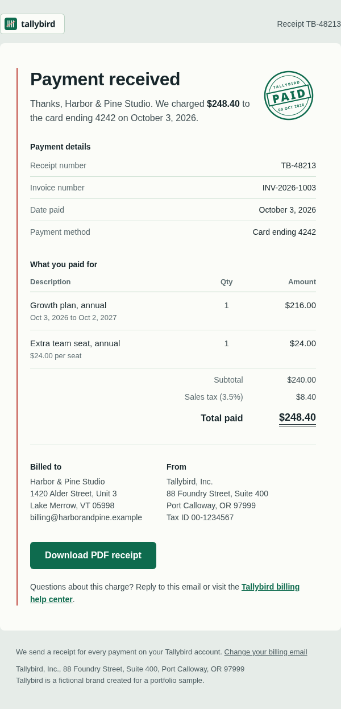
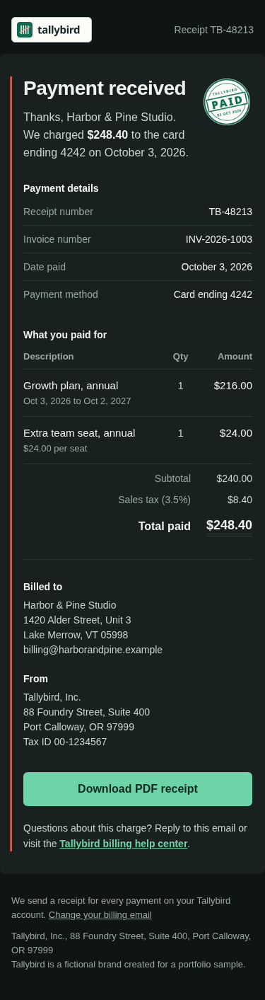

# Tallybird: promotional and transactional email

Two emails for an invoicing app: an annual-plan offer and a payment receipt. Both use a ledger-paper look: a red double margin rule, green ruled rows, tabular figures and an accountant's double underline on totals.

Tallybird is a fictional brand created for a portfolio sample. Names, addresses, tax IDs and links (`*.example`) are invented.

| Offer, 600px | Receipt, 600px | Receipt, 375px dark |
| --- | --- | --- |
|  |  |  |

## Files

```text
promo-annual-plan.html   marketing: monthly vs annual cost table, one CTA
receipt.html             transactional: payment details, line items, totals, billing addresses, PDF link, help link
images/                  logo and paid stamp (PNG, referenced relatively)
scripts/check.mjs        static checks (see Testing)
scripts/screenshots.mjs  headless Chromium renders into screenshots/
```

Two templates don't justify a build step, so both are hand-written with inline styles and share the same head.

## What each email shows

### promo-annual-plan.html

- The offer is live text, not an image: the headline states the saving and a three-row table shows the arithmetic, so the message survives images-off and screen readers.
- One call to action. The button is the padding-based bulletproof pattern: `mso-padding-alt:0` plus `mso-text-raise` and `mso-font-width` spacers inside MSO conditionals give Outlook on Windows the same full-size click area as everywhere else.
- Footer separates offer emails from account email and links to preferences and unsubscribe.

### receipt.html

- Payment details and line items are real data tables (`<caption>`, `<th scope>`); every layout table is `role="presentation"`.
- Amounts use `font-variant-numeric: tabular-nums` and `white-space: nowrap` so columns align and prices never wrap.
- Billing addresses are hybrid columns: side by side at 600px, stacked on mobile without a media query, fixed by a ghost table in Outlook.
- No unsubscribe link: it's a transactional message. The footer says why it was sent and links to billing settings.

## Platform notes

Placeholders `{{preferences_url}}` and `{{unsubscribe_url}}` in the offer footer are neutral; replace them with your ESP's tags (for example `*|UPDATE_PROFILE|*` / `*|UNSUB|*` in Mailchimp, `` / `` in Klaviyo). The receipt values (amounts, receipt number, addresses) would come from the sending app's template variables.

Before sending, host `images/` and switch `src` paths to absolute URLs. Both files are under 17 KB, well below Gmail's 102 KB clipping limit.

## Client support

- Outlook 2016-365 on Windows: ghost table around the 600px container and columns, `OfficeDocumentSettings` with `PixelsPerInch` 96, `mso-line-height-rule: exactly`, MSO-only font fallback for table cells.
- Dark mode: `color-scheme` meta and `:root` declaration, `prefers-color-scheme` overrides, and `[data-ogsc]` / `[data-ogsb]` overrides for Outlook.com, each in its own `<style>` block. The logo and stamp carry their own paper background, so they read as labels on a dark page instead of vanishing.
- Forced inversion: text sits only on the paper and page colours, both light, so clients that invert get predictable output.
- Accessibility: `lang`, a single H1, `role="article"` wrapper, decorative check marks hidden with `aria-hidden`, link text that names its destination.

## Testing

```sh
npm run check
npm run screenshots   # requires Chromium; set CHROME_PATH if it isn't on PATH
```

`check.mjs` fails on: size at or above 102 KB, missing `lang`/`title`/PixelsPerInch/color-scheme meta, external CSS or scripts, unbalanced tags or conditional comments, layout tables without `role="presentation"`, structural `<div>`s, images missing `alt`/`width`/`border`/`display:block` or a file on disk, and vague link text.

Screenshots are Chromium renders at 600px and 375px in light, `prefers-color-scheme: dark`, and a forced-dark approximation. They don't replace a Litmus or Email on Acid pass; the Outlook-specific markup has not been rendered in Outlook itself.

Type is Avenir Next, falling back to Avenir, Segoe UI and Arial. The screenshots were rendered on Linux, where the fallback is Liberation Sans.
